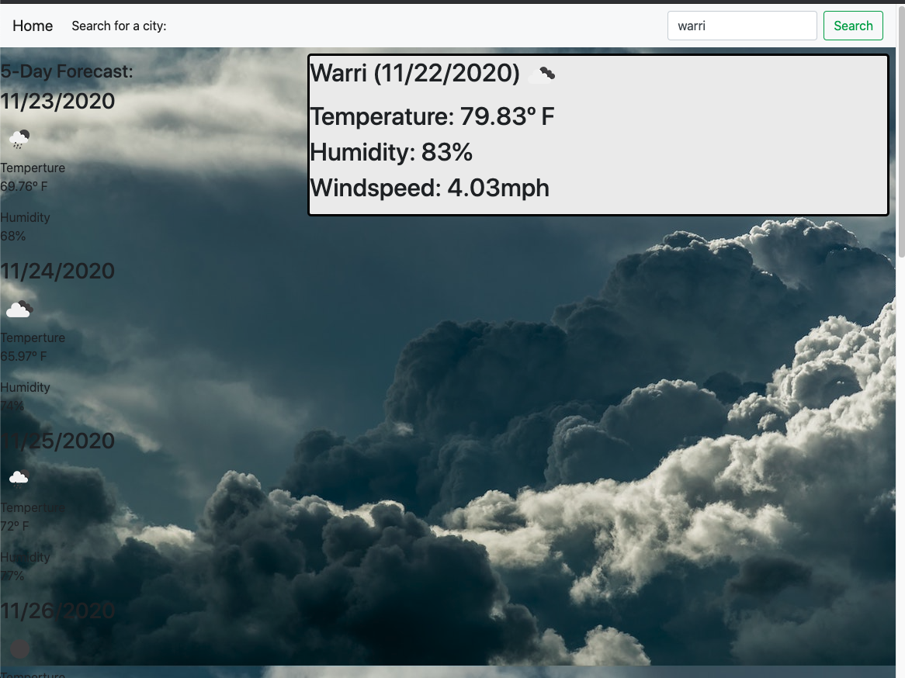

# Weather-Dashboard

This is a Weather Dashboard that uses third-party APIs to retrieve data and use it in the context of its own. This application have the ability to display the weather outlook of multiple cities at a time. When a user search for a city, the user is presented with current and future conditions for that city and that city is added to the search history. When a user view current weather conditions for that city, the user is presented with the city name, the date, an icon representation of weather conditions, the temperature, the humidity, the wind speed, and the UV index. When a user view future weather conditions for that city, the user is resented with a 5-day forecast that displays the date, an icon representation of weather conditions, the temperature, and the humidity.

## Screen shot

## Link to application

[Click here for link](https://afam-26.github.io/Weather-Dashboard/)

## credit

Brennan Predmore TA
